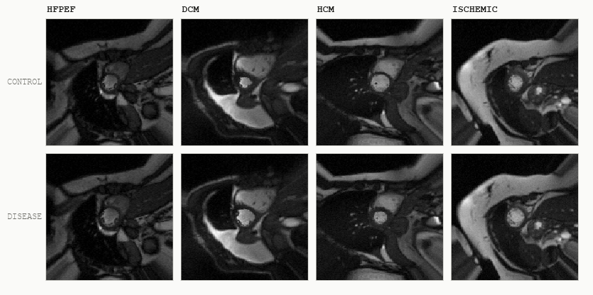

<div align="center">

# DrugTargetBench

### A contamination-resistant, agentic benchmark for autonomous therapeutic target discovery

*Twenty sealed causal worlds. Raw multi-omics and cine-MRI in, ranked drug targets out.*

[](LICENSE)
[](https://www.python.org/downloads/)
[](#citation)
[](#data)
[](https://drugtargetbench.vercel.app)

<br>



<sub>Four archetypes, control against diseased. Each pair shares one base anatomy and one noise stream, so only the hidden latent severity differs.</sub>

</div>

---

**DrugTargetBench** measures whether an AI agent can run an entire target-discovery program without being told what the disease is.
Each instance is a procedurally generated population of up to 54,000 subjects with genotypes, 2,941 plasma proteins, matched transcripts, 150 metabolites, ICD-10 and ATC records, ECG, coronary CT, raw short-axis cine-MRI of real cardiac anatomy, a five-year second visit, and 12-year survival.
There is no phenotype column and no answer key.
The agent must derive a cardiac phenotype from pixels, screen 2,941 molecules for causal drivers against 8,192 genetic variants, spend a hard budget of 5 virtual knockdown experiments on the questions observational data cannot settle, and submit a ranked target list with a therapeutic direction for each.
Ten planted trap mechanisms make naive correlation and blanket skepticism both fail.

In run 1 — 9 models × 20 worlds × 3 budget regimes, 540 episodes, rubric v0.9 — the best agent scored **39.98 of a measured 85.5 ceiling**, and 416 of 540 episodes earned zero phenotype-construction credit.

---

## News

- **2026-XX-XX**: Benchmark, panel, and run-1 results released. Hugging Face dataset and paper links pending.

---

## Table of Contents

- [Why a synthetic benchmark](#why-a-synthetic-benchmark)
- [Architecture](#architecture)
- [The world, layer by layer](#the-world-layer-by-layer)
- [Intervention](#intervention)
- [Isolation](#isolation)
- [The ten traps](#the-ten-traps)
- [The task](#the-task)
- [Scoring](#scoring)
- [Run-1 results](#run-1-results)
- [Quick start](#quick-start)
- [Data](#data)
- [Training](#training)
- [Testing](#testing)
- [Access tiers](#access-tiers)
- [Structural limits](#structural-limits)
- [Project layout](#project-layout)
- [Citation](#citation)
- [License](#license)

---

## Why a synthetic benchmark

Target discovery has no clean held-out set.
Every published target is in every model's training data, and every real cohort carries a data-use agreement that forbids the open redistribution a benchmark needs.
DrugTargetBench resolves both by generating the ground truth.

Each world is drawn fresh from a structural causal model, so the driver identities, weights, trap composition, and archetype are sampled per instance.
Knowing the design reveals nothing about any instance — which is what makes the code safe to publish while the answer keys stay sealed.
Because the generator is the ground truth, an intervention is a real counterfactual: clamping a molecule re-runs every downstream structural equation rather than returning a stored lookup.

---

## Architecture

One seed produces two asymmetric halves.
The agent reads one; the scorer and the oracle read the other.

```
        seed + config
              │
              ▼
      ┌───────────────┐
      │  generator/   │
      └───────┬───────┘
              │
      ┌───────┴────────────────────────────┐
      ▼                                    ▼
┌───────────┐                      ┌───────────────┐
│ release/  │  the agent reads     │   sealed/     │  answer key
│  4.1 GB   │  only this           │    ~1 MB      │  organizer only
└─────┬─────┘                      └───────┬───────┘
      │                                    │ loaded once at startup
      │                                    ▼
      │                            ┌───────────────┐
      │        budgeted            │   oracle/     │  re-runs the SCM
      │        interventions ─────▶│    server     │  budget + audit here
      │                            └───────────────┘
      ▼                                    │
┌───────────┐                              │ sealed truth
│   agent   │                              │
└─────┬─────┘                              ▼
      │  submission.json            ┌───────────────┐
      └────────────────────────────▶│   scoring/    │──▶ score.json
                                    └───────────────┘
```

| | size | regenerable | who may read it |
|---|---|---|---|
| `release/` | 243 MB without imaging, 4.1 GB with | yes, from the seed | the agent |
| `sealed/` | ~1 MB | no | organizer and scorer only |

Release data is disposable; sealed data is not.
An agent-visible episode is five stages:

```
Biobank  →  Phenotype  →  Causal targets  →  Experiments  →  Submission
genetics    segment the   screen the         spend a         nominate
omics       myocardium    proteome,          finite          targets and
imaging     from raw      instrument it      research        therapeutic
ECG, EHR    arrays, fit   genetically,       budget          direction
            against a     separate drivers
            proxy label   from decoys
```

The agent receives the files, writes its own Python, and chooses analyses and experiments over 30 turns.
Full module map and isolation guarantees: [docs/ARCHITECTURE.md](docs/ARCHITECTURE.md).

---

## The world, layer by layer

The generator is one causal chain.
Each arrow is a structural equation, and the whole chain re-runs under intervention.

```
  genotypes ────────────┐
  (LD blocks, strata)   │
                        ▼
  latent factors ──▶ proteome ──┬──▶ transcripts
  (12, unobserved)   (2,941)    └──▶ metabolites
                        │
                        │  drivers, weighted
                        ▼
  covariates ──────▶ latent trait L ──┬──▶ morphology ──▶ cine-MRI
  (age, sex, BMI,      (severity)     │    (theta)        phantom or ACDC
   smoking, site;          │          ├──▶ ICD-10 / ATC records
   released under          │          ├──▶ ECG, coronary
   UKB field IDs)          │          └──▶ survival: mortality, MACE
                           │
                           ▼  five years on
                    L2 = 0.75·L + 0.35·(P[drivers] @ w_late)
                           │
                           └──▶ visit-2 proteome, morphology, imaging
```

The latent disease state is a weighted sum over hidden driver proteins, covariates, a direct genetic effect, and noise:

```
L_i = z[ Σ_{j∈D} w_j P_ij  +  γᵀ C_i  +  δ G_i,direct  +  ε_i ]
```

The identity and the number of causal drivers are both hidden.
`w_late` differs from `w` for one driver per world, which is what lets an effect be near-invisible at visit 1 and substantial by visit 2.

The agent's side of the same loop is a budgeted policy: it samples an action from `a_t ~ π(a | s_t, B_t)` and the budget decrements by that action's cost, `B_{t+1} = B_t - c(a_t)`.
Analysis of already-held data is free; laboratory intervention is not.

---

## Intervention

`simulate_scm(..., clamp={molecule: value})` pins a molecule and re-runs everything downstream.
That single hook is what makes an intervention a counterfactual rather than a lookup.

```
  observational                     interventional
  ─────────────                     ──────────────
  proteome as generated             proteome with molecule j clamped
        │                                   │
        ▼                                   ▼
   L, morphology,                     L', morphology',
   survival                           survival'
        │                                   │
        └────────────  delta  ──────────────┘
                         │
                         ▼
              what the oracle returns
```

Non-drivers return a delta of exactly zero, because clamping them changes no downstream equation.

---

## Isolation

What the agent can reach, and what it cannot.

```
   organizer side                  │        agent side
  ─────────────────────────────────┼──────────────────────────────
   sealed/                         │   private copy of release/
   generator source                │   task statement
   scoring/                        │   oracle_client.py (stateless)
   oracle server process           │   its own working directory
   audit log                       │
                                   │
        ▲                          │            │
        └──── HTTP, budgeted ──────┴────────────┘
              token-authenticated
```

The oracle server loads sealed state at startup and never re-reads disk, so the sealed directory can be made unreachable while an agent runs.
The audit log is written outside the agent's working directory and the client holds no state, so filesystem access on the agent side reveals nothing.
Every charged action and every purchased intervention is logged outside the agent's sandbox, so nothing the agent writes to disk is trusted as evidence by the scorer.

---

## The ten traps

Each world carries a subset, recorded in the sealed manifest.

| Code | Mechanism | What it punishes |
|---|---|---|
| T1 | Confounding | Association driven by a common cause. |
| T2 | Reverse causation | Disease causes the marker, not the reverse. |
| T3 | Selection / collider | Association induced by selection into the imaged sub-cohort. |
| T4 | Causal non-identifiability | Causal and decoy load on one cis variant; no instrument separates them. |
| T5 | Batch effects | Site ↔ ancestry structure masquerading as signal. |
| T6 | Benign remodeling | Real structural change, athlete's heart, no outcome consequence. |
| T7 | Instrument pleiotropy | The instrument violates the exclusion restriction. |
| T8 | Surrogate-outcome discordance | Improves the imaging surrogate while worsening survival. |
| T9 | Assay unit mixing | Measurement artifact from mixed units, `--messy` only. |
| A9 | Slow effect | The causal member of the pair only expresses by visit 2. |

T4 and A9 are unresolvable from observational data by construction; spending intervention budget is the only way through them.
T5 and T6 plant no protein and so cannot be rejected, which caps the discrimination denominator.

Two difficulty tiers (standard and `--hard`: nonlinear saturating biology, gene–gene synergy, weak instruments, polygenic background), an optional `--messy` UK Biobank-style presentation, and `--null-world` instances where the correct answer is "nothing here" supply the rest of the structural variation.

---

## The task

The agent-facing brief is [docs/TASK.md](docs/TASK.md).
In short, it receives:

| File | Contents |
|---|---|
| `genotypes.vcf.gz` | 8,192 variants for all subjects, LD-blocked |
| `proteomics.parquet` | 2,941 plasma proteins, standardized, sparse missingness |
| `transcriptomics.parquet` | matched blood mRNA; `TRANS_xxxx` pairs with `PROT_xxxx`, ~3% missing |
| `metabolomics.parquet` | 150 plasma metabolites, ~2% missing |
| `covariates.parquet` | age, sex, BMI, smoking, exercise, centre, `imaged` flag — under UK Biobank field IDs |
| `data_dictionary.tsv` | field ID → description, plus documented negative sentinel codes |
| `ehr_diagnoses.parquet`, `ehr_medications.parquet` | ICD-10 diagnoses with dates, ATC medications |
| `imaging/SUBJ_XXXXX.npz` | raw short-axis cine-MRI under `cine`, shape (slices, frames, H, W) uint8, plus native T1 maps under `t1map` |
| `targetability.parquet` | per-molecule constraint, localisation, binding pocket, paralog redundancy, tissue specificity |
| `oracle_client.py` | 5 virtual knockdown experiments, enforced server-side |

And it returns a `submission.json` with `drivers` (ranked, each with `evidence`, `direction`, and `outcome_alignment`), optional `rejected_decoys` (each with one of five named mechanisms), optional `abstentions` (sets of molecules judged unidentifiable), and an optional `phenotype_file`.

Two properties of the task are load-bearing.
**There is no phenotype column** — how you define cardiac severity, from pixels or diagnoses or anything else, is part of the problem.
The headroom is measurable: averaging the myocardium over a native T1 map recovers the latent state at r = 0.57, while reading its spatial arrangement reaches 0.80, and phenotype credit is scored as the fraction of that gap the agent's own code closes.
**Any method is allowed** — scoring never inspects how a claim was reached, only the claim, its verification, and its calibration.

---

## Scoring

Rubric v0.9, 100 points, in [docs/EVALUATION.md](docs/EVALUATION.md).

| Component | Points | Form |
|---|---|---|
| Target identification | 30 | recall × precision over claimed drivers |
| Causal confidence | 25 | calibrated per unidentifiable pair present (T4, A9, or both) |
| Discrimination | 15 | recall × precision over rejected decoys, mechanism must be correct |
| Direction of effect | 20 | `inhibit` / `activate` against the sealed sign of each driver weight |
| Phenotype construction | 10 | against a sealed target on held-out subjects |
| Safety | −30 | asymmetric penalty for advancing the T8 liability as `aligned` |

Recall × precision throughout means a wrong claim dilutes credit rather than being free.
Causal confidence orders the three honest strategies: a real, audited experiment on the true causal member earns full credit, abstention on the complete pair earns partial credit, and an unsupported confident pick earns nothing.
Abstention credit carries the same precision term over every entry submitted, so reaching a pair by enumerating candidates is worth the corresponding fraction and nothing more.
Effect size, allele frequency, targetability rank, rationale length, and free-text confidence add no points.

Scores are not comparable across rubric versions, and every score records its `rubric_version`.
Rubric v0.9 is the scorer that produced the results below; presenting it as the validated headline rubric is a separate open gate.

---

## Run-1 results

9 models × 20 worlds × 3 budget regimes × 1 replicate = 540 episodes, rubric v0.9, panel `cardioseek-v2-20260902`, provenance commit `85c1ab70`.
Scores are means over 60 episodes per arm, out of a measured ceiling of **85.5** set by an omniscient reference policy — not an implied 100.

| Model | Overall | SD | Best | Target /30 | Direction /20 | Phenotype /10 | Turns | USD/episode |
|---|---|---|---|---|---|---|---|---|
| Opus 5 | **39.98** | 20.48 | 86.64 | 14.80 | 13.05 | 7.19 | 27.6 | 4.136 |
| GPT-5.6 Sol | 35.38 | 20.48 | 83.19 | **15.81** | 13.00 | 3.16 | 18.2 | 2.020 |
| Sonnet 5 | 21.33 | 21.83 | 83.88 | 10.24 | 6.96 | 1.16 | 28.4 | 1.466 |
| Haiku 4.5 | 12.92 | 16.87 | 75.00 | 5.27 | 5.91 | 0.21 | 12.0 | 0.256 |
| gpt-oss-20b | 7.41 | 15.21 | 75.00 | 2.94 | 3.43 | 0.68 | 8.2 | 0.065 |
| Qwen3-Coder-30B | 5.90 | 12.20 | 75.00 | 3.26 | 1.94 | 0.14 | 7.1 | 0.053 |
| GLM-4-32B | 1.46 | 4.75 | 25.00 | 1.12 | 0.25 | 0.08 | 25.9 | 0.197 |
| Qwen3-8B | 1.31 | 4.58 | 30.71 | 0.70 | 0.22 | 0.39 | 17.3 | 0.220 |
| Devstral-Small | 0.81 | 3.29 | 15.00 | 0.75 | 0.00 | 0.06 | 29.2 | 0.198 |

API arms are billed cost divided over 60 episodes.
Self-hosted arms are GPU-hours × 2.50 USD/hour divided over 60 episodes, an upper bound because GPU-hours charge server residency rather than time under load.
Interactive leaderboard, cost frontier, and rendered disease states: **[drugtargetbench.vercel.app](https://drugtargetbench.vercel.app)**.

### Reading the table

The spread is wide and the ceiling is far away.
Opus 5's best single episode, 86.64, exceeds the reference ceiling of 85.5, while its mean is 39.98 — the variance across worlds is larger than the gap between the top two models.
Phenotype construction is where the field collapses: 416 of 540 episodes earned zero credit on a 10-point component, and only Opus 5 cleared 7 of 10.
Haiku 4.5 is the cheapest per point at 0.256 USD/episode for 12.92 points.

### Caveats that travel with these numbers

Single replicate, so there is no within-cell variance.
GLM-4-32B and Qwen3-8B ran an 8,000-token output budget against the protocol's 32,000 and are not a like-for-like comparison.
gpt-oss-20b is native MXFP4, so quantisation is a confound.
Devstral-Small reached the turn limit in 53 of 60 episodes.
Participant counts vary by world; 54,000 is the largest.

---

## Quick start

The harness resolves world data itself — it checks the local cache, then the pinned immutable asset repository, and materialises everything a trial needs before the agent starts.
You do not identify files, move images, construct worlds, or run preprocessing.

```bash
uv tool install harbor

harbor run \
  -d drugtargetbench/drugtargetbench@v1.0 \
  -a <agent> \
  -m <model>
```

**One-time prerequisite for the imaging.**
The cine-MRI is warped from the ACDC dataset, which is registration-gated and cannot be redistributed.
Register at no cost at <https://humanheart-project.creatis.insa-lyon.fr>, download the ACDC training set once, and point the harness at it:

```bash
export DTB_ACDC_ROOT=/path/to/authorized/ACDC/training
```

Everything else — proteomics, transcriptomics, metabolomics, genotypes, EHR, ECG, survival — is generated and downloads with no prerequisite.
The phantom imaging backend needs nothing at all.

| | |
|---|---|
| Tasks | 60 (20 worlds × 3 budget regimes) |
| Unique world data | 345 GB |
| Largest single task | 17.4 GB |
| Downloads without ACDC | 72.5 GB |
| Requires authorised ACDC | 272.8 GB |
| Scoring | rubric v0.9 |

A full sweep materialises each of the 20 worlds once, not once per task: the three regime tasks for a world share one immutable payload and one build cache.
Budget disk for the unique 345 GB plus container overhead, not for the 1.03 TB you get by summing tasks independently.

> The Harbor dataset id and the asset repository are published with the release.
> Until then the commands above are the intended interface, not a live one.

---

## Data

| Artifact | Status |
|---|---|
| World panel `cardioseek-v2-20260902` (20 worlds, 345 GB) | pending |
| Run-1 episode table (540 rows × 65 columns) | pending |
| Run-1 transcripts (576 `transcript.json`, 440 `submission.json`) | pending |
| Hugging Face dataset | pending |
| Paper | pending |

Sealed directories — `manifest.json`, `latent_L.npy`, `eval_mask.npy`, `phenotype_baseline.json` — are the answer key and are never part of a release bundle.

---

## Training

`training/` is reserved for the reinforcement-learning and expert-iteration configs that turn the generator into a practice environment: unlimited world generation with dense per-behaviour feedback, single-turn bandit and multi-turn rollout tiers, vLLM serving, and GRPO.
It is empty in this release.

---

## Testing

`testing/` is reserved for the evaluation-side artifacts: the frozen panel manifest, the golden rubric test matrix, and the reproduction scripts for the run-1 table.
It is empty in this release.

---

## Access tiers

1. **Fully synthetic (this repository).** No participant data, no data-use agreement, no PII; usable by anyone, anywhere. Structural randomization is why openness is safe — knowing the design never reveals an instance.
2. **Calibrated synthetic.** A `mesa-topmed` profile anchors the synthetic world to aggregate MESA/TOPMed cohort statistics. Public-code compatible, with no participant rows or identifiers in the repository. Check the applicable study acknowledgement and derived-result disclosure requirements before publishing a calibration file.
3. **Planted truth in real data (design).** Synthetic signal on real cohort backgrounds such as TOPMed or MESA, run only inside data-use-agreement-compliant environments with local or open-weights agents, and never redistributed.

**Imaging license.** Real-anatomy images derive from ACDC and this repository distributes no ACDC derivatives.
Users download ACDC themselves under free registration and render locally.

A governance audit runs beside the oracle audit: every knockdown request and every piece of agent-side evidence is checked against a data-use policy covering individual-level egress, cross-cohort joins, re-identification probing, and out-of-scope access, and recorded outside the agent's working directory.
In v0.9 this is logged, not scored.

---

## Structural limits

Stated plainly, because they bound what a score here means.

- *cis* fraction is 1.0 against roughly 0.297 in real data, so Mendelian randomization is easier here than in reality.
- Plain correlation still ranks a true driver first in 7 of 10 panel worlds. The hard and messy tiers are genuinely hard and the standard tier is the easy end, so results should be reported by tier.
- Molecules carry no biological identity, so no prior knowledge of real biology transfers.
- Missingness is informative through bounded severity, site, participation, and assay-level intercept terms.
- Individuals are sampled independently, so there is no relatedness structure.
- The rendered cine-MRI on the public site comes from development worlds, not the frozen evaluation panel, whose imaging is not redistributed.

---

## Project layout

```
DrugTargetBench/
├── README.md
├── LICENSE
├── CITATION.cff
├── docs/
│   ├── ARCHITECTURE.md      # module map, release/sealed boundary, isolation
│   ├── TASK.md              # the agent-facing challenge statement
│   ├── EVALUATION.md        # rubric v0.9 components and scoring form
│   └── figures/
├── training/                # RL and expert-iteration configs (empty)
└── testing/                 # panel manifest, golden rubric matrix (empty)
```

The generator, oracle, scorer, and harness are published with the release.
Their intended layout:

```
generator/    genotypes.py  scm.py  ehr.py  imaging.py  acdc_warp.py  generate.py
scoring/      score.py                     active rubric v0.9 scorer
oracle/       oracle_server.py  oracle_api.py  oracle_client.py  governance_policy.py
actions/      registry.json  library.py  meter.py  world.py
policies/     library.py                  reference policies, random through omniscient
harness/      run_agent.py  run_study.py  build_panel.py  prepare_arena.py
experiments/  run_policies.py  run_agents.py  export_csv.py  integrity_audit.py
realism/      realism_report.py  mesa_calibration_report.py
```

---

## Citation

```bibtex
@article{drugtargetbench2026,
  title   = {{DrugTargetBench}: A contamination-resistant, agentic benchmark for
             autonomous therapeutic target discovery},
  author  = {TBD},
  journal = {arXiv preprint},
  year    = {2026},
  url     = {https://arxiv.org/abs/XXXX.XXXXX}
}
```

---

## License

Released under the [MIT License](LICENSE).

Real-anatomy cine-MRI derives from the [ACDC dataset](https://humanheart-project.creatis.insa-lyon.fr) and is subject to its own terms.
This repository distributes no ACDC data or derivatives.

---

<div align="center">
<i>DrugTargetBench is a research benchmark on synthetic data.<br>
No result here is evidence about a real therapeutic target.</i>
</div>
