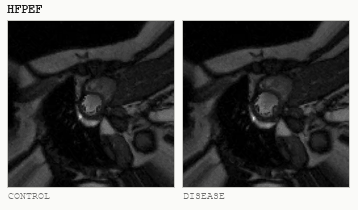
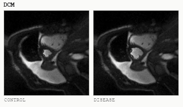
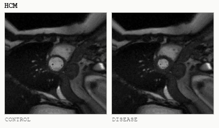
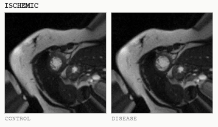

<div align="center">

# DrugTargetBench

### An Environment for Therapeutic Target Discovery

[](LICENSE)
[](https://www.python.org/downloads/)
[](#citation)
[](https://hub.harborframework.com/datasets/drugtargetbench/drugtargetbench)
[](https://huggingface.co/datasets/sammargolis/drugtargetbench-assets)
[](https://drugtargetbench.vercel.app)

Samuel Margolis<sup>1,2</sup>, Paul Schmiedmayer<sup>1</sup>, Alan Huang<sup>1,2</sup>, Ethan Chen<sup>3</sup>, Ishan Bhattacharjee<sup>1</sup>, Atman Shah<sup>3</sup>, Fang Cao<sup>1,2</sup>, Euan Ashley<sup>1,2</sup>, Bruna Gomes<sup>†1,2</sup>

<sub>
<sup>1</sup>Department of Biomedical Data Science, Stanford University, Stanford, CA 94305, USA<br>
<sup>2</sup>Department of Medicine, Stanford University, Stanford, CA 94305, USA<br>
<sup>3</sup>Brown University, Providence, RI 02912, USA<br>
<sup>†</sup>Corresponding author: Bruna Gomes.
</sub>

<br><br>

| | |
|:--:|:--:|
|  |  |
|  |  |

<sub>Rendered cine-MRI from four cardiac archetypes, control against diseased. Within each pair both loops share one base anatomy and one noise stream, so the only difference is the hidden latent severity. Control is drawn from the 4th percentile of the sealed latent and diseased from the 97th.</sub>

</div>

---

## Table of Contents

- [Run it](#run-it)
- [Why a simulated environment](#why-a-simulated-environment)
- [Architecture](#architecture)
- [The world, layer by layer](#the-world-layer-by-layer)
- [Intervention](#intervention)
- [Isolation](#isolation)
- [The ten traps](#the-ten-traps)
- [The task](#the-task)
- [Scoring](#scoring)
- [Initial evaluation](#initial-evaluation)
- [Access tiers](#access-tiers)
- [Repository layout](#repository-layout)
- [Citation](#citation)
- [License](#license)

---

## Run it

```bash
uv tool install harbor

harbor run \
  -d drugtargetbench/drugtargetbench@v1.0 \
  -a claude-code \
  -m claude-opus-5
```

That is everything.
Harbor pulls the task, pulls the image, downloads and checksum-verifies the world data, starts the experiment service, runs your agent, then scores it in a separate verifier container.

### Useful flags

```bash
# one task instead of all 60
harbor run -d drugtargetbench/drugtargetbench@v1.0 -a claude-code -m <model> --limit 1

# a single specific task
harbor run -p drugtargetbench/hard-02-full-program -a claude-code -m <model>

# concurrency (default 4) — each concurrent trial needs ~17 GB of disk
harbor run -d drugtargetbench/drugtargetbench@v1.0 -a claude-code -m <model> -n 2

# 3 attempts per task
harbor run -d drugtargetbench/drugtargetbench@v1.0 -a claude-code -m <model> -k 3
```

Agents available: `claude-code`, `codex`, `aider`, `swe-agent`, `terminus`, `oracle`, and others — `harbor agent list`.

### What to expect

| | |
|---|---|
| Tasks | 60 — 20 worlds × 3 budget regimes |
| First run per world | downloads ~17 GB |
| Full sweep | ~345 GB unique, each world once rather than once per task |
| Disk needed | 345 GB plus Docker overhead |
| Scoring | rubric v0.9, 0–100, normalised to 0–1 for Harbor |

Results land in `jobs/`.
Each trial writes `reward.txt` and a `score.json` carrying the full component breakdown: target identification, causal confidence, discrimination, direction of effect, phenotype construction, safety penalty.

> [!NOTE]
> No full 17 GB trial has run end to end yet.
> Every component is verified — the pinned revision resolves, checksums match, the experiment service loads, the verifier scores 43.33 to reward 0.4333, and all 60 tasks download clean from the registry — but bulk materialization inside a Harbor-managed build has not been exercised.
> Run one complete task before pointing a sweep at it.
---

## Why a simulated environment

Target discovery has no clean held-out set.
Published targets appear in model training data, and real cohorts carry data-use agreements that forbid the open redistribution a benchmark needs.
More fundamentally, a real biobank cannot say which of its correlations are causal, so it cannot grade a causal claim.

DrugTargetBench generates the ground truth instead.
Each world is drawn fresh from a structural causal model, so driver identities, weights, trap composition and archetype are sampled per instance.
Knowing the design reveals nothing about any instance, which is what makes the design safe to describe openly while the answer keys stay sealed.
Because the generator *is* the ground truth, an intervention is a real counterfactual: clamping a molecule re-runs every downstream structural equation rather than returning a stored lookup.

---

## Architecture

One seed produces two asymmetric halves.
The agent reads one; the scorer and the oracle read the other.

```
        seed + config
              │
              ▼
      ┌───────────────┐
      │  generator/   │
      └───────┬───────┘
              │
      ┌───────┴────────────────────────────┐
      ▼                                    ▼
┌───────────┐                      ┌───────────────┐
│ release/  │  the agent reads     │   sealed/     │  answer key
│  4.1 GB   │  only this           │    ~1 MB      │  organizer only
└─────┬─────┘                      └───────┬───────┘
      │                                    │ loaded once at startup
      │                                    ▼
      │                            ┌───────────────┐
      │        budgeted            │   oracle/     │  re-runs the SCM
      │        interventions ─────▶│    server     │  budget + audit here
      │                            └───────────────┘
      ▼                                    │
┌───────────┐                              │ sealed truth
│   agent   │                              │
└─────┬─────┘                              ▼
      │  submission.json            ┌───────────────┐
      └────────────────────────────▶│   scoring/    │──▶ score.json
                                    └───────────────┘
```

| | size | regenerable | who may read it |
|---|---|---|---|
| `release/` | 243 MB without imaging, 4.1 GB with | yes, from the seed | the agent |
| `sealed/` | ~1 MB | no | organizer and scorer only |

Release data is disposable; sealed data is not.
An episode is five stages:

```
Biobank  →  Phenotype  →  Causal targets  →  Experiments  →  Submission
genetics    segment the   screen the         spend a         nominate
omics       myocardium    proteome,          finite          targets and
imaging     from raw      instrument it      research        therapeutic
ECG, EHR    arrays, fit   genetically,       budget          direction
            against a     separate drivers
            proxy label   from decoys
```

The agent receives the files, writes its own Python, and chooses analyses and experiments over 30 turns.
Full module map and isolation guarantees: [docs/ARCHITECTURE.md](docs/ARCHITECTURE.md).

---

## The world, layer by layer

The generator is one causal chain.
Each arrow is a structural equation, and the whole chain re-runs under intervention.

```
  genotypes ────────────┐
  (LD blocks, strata)   │
                        ▼
  latent factors ──▶ proteome ──┬──▶ transcripts
  (12, unobserved)   (2,941)    └──▶ metabolites
                        │
                        │  drivers, weighted
                        ▼
  covariates ──────▶ latent trait L ──┬──▶ morphology ──▶ cine-MRI
  (age, sex, BMI,      (severity)     │    (theta)        phantom or ACDC
   smoking, site;          │          ├──▶ ICD-10 / ATC records
   released under          │          ├──▶ ECG, coronary
   UKB field IDs)          │          └──▶ survival: mortality, MACE
                           │
                           ▼  five years on
                    L2 = 0.75·L + 0.35·(P[drivers] @ w_late)
                           │
                           └──▶ visit-2 proteome, morphology, imaging
```

The latent disease state is a weighted sum over hidden driver proteins, covariates, a direct genetic effect, and noise:

```
L_i = z[ Σ_{j∈D} w_j P_ij  +  γᵀ C_i  +  δ G_i,direct  +  ε_i ]
```

The identity and the number of causal drivers are both hidden from the agent.
`w_late` differs from `w` for one driver per world, which is what lets an effect be near-invisible at visit 1 and substantial by visit 2.

The agent's side of the same loop is a budgeted policy: it samples an action from `a_t ~ π(a | s_t, B_t)` and the budget decrements by that action's cost, `B_{t+1} = B_t − c(a_t)`.
Analysis of already-held data is free, because a regression over data the cohort already holds is compute rather than a purchase.
Only laboratory work is priced.

---

## Intervention

`simulate_scm(..., clamp={molecule: value})` pins a molecule and re-runs everything downstream.
That single hook is what makes an intervention a counterfactual rather than a lookup.

```
  observational                     interventional
  ─────────────                     ──────────────
  proteome as generated             proteome with molecule j clamped
        │                                   │
        ▼                                   ▼
   L, morphology,                     L', morphology',
   survival                           survival'
        │                                   │
        └────────────  delta  ──────────────┘
                         │
                         ▼
              what the oracle returns
```

Non-drivers return a delta of exactly zero, because clamping them changes no downstream equation.

---

## Isolation

What the agent can reach, and what it cannot.

```
   organizer side                  │        agent side
  ─────────────────────────────────┼──────────────────────────────
   sealed/                         │   private copy of release/
   generator source                │   task statement
   scoring/                        │   oracle_client.py (stateless)
   oracle server process           │   its own working directory
   audit log                       │
                                   │
        ▲                          │            │
        └──── HTTP, budgeted ──────┴────────────┘
              token-authenticated
```

The oracle server loads sealed state at startup and never re-reads disk, so the sealed directory can be made unreachable while an agent runs.
The audit log is written outside the agent's working directory and the client holds no state, so filesystem access on the agent side reveals nothing.
Every charged action and every purchased intervention is logged outside the agent's sandbox, so nothing the agent writes to disk is trusted as evidence by the scorer.

---

## The ten traps

Each world carries a subset, recorded in the sealed manifest.

| Code | Mechanism | What it punishes |
|---|---|---|
| T1 | Confounding | Association driven by a common cause. |
| T2 | Reverse causation | Disease causes the marker, not the reverse. |
| T3 | Selection / collider | Association induced by selection into the imaged sub-cohort. |
| T4 | Causal non-identifiability | Causal and decoy load on one cis variant; no instrument separates them. |
| T5 | Batch effects | Site ↔ ancestry structure masquerading as signal. |
| T6 | Benign remodeling | Real structural change, athlete's heart, no outcome consequence. |
| T7 | Instrument pleiotropy | The instrument violates the exclusion restriction. |
| T8 | Surrogate-outcome discordance | Improves the imaging surrogate while worsening survival. |
| T9 | Assay unit mixing | Measurement artifact from mixed units, messy presentation only. |
| A9 | Slow effect | The causal member of the pair only expresses by visit 2. |

T4 and A9 are unresolvable from observational data by construction, so spending intervention budget is the only way through them.
T5 and T6 plant no protein and so cannot be rejected, which caps the discrimination denominator.

Two difficulty tiers — standard, and a hard tier with nonlinear saturating biology, gene–gene synergy, weak instruments and polygenic background — plus an optional messy UK Biobank-style presentation and null-world instances where the correct answer is "nothing here" supply the rest of the structural variation.
Panel worlds are stratified across those conditions, so results should be read by tier rather than pooled.

---

## The task

The agent-facing brief is [docs/TASK.md](docs/TASK.md).
A biobank of 54,000 synthetic participants lands in `/app/data`, with no phenotype column:

| File | Contents |
|---|---|
| `genotypes.vcf.gz` | 8,192 variants for all subjects, LD-blocked |
| `proteomics.parquet` | 2,941 plasma proteins, standardized, sparse missingness |
| `transcriptomics.parquet` | matched blood mRNA; `TRANS_xxxx` pairs with `PROT_xxxx`, ~3% missing |
| `metabolomics.parquet` | 150 plasma metabolites, ~2% missing |
| `covariates.parquet` | age, sex, BMI, smoking, exercise, centre, `imaged` flag — under UK Biobank field IDs |
| `data_dictionary.tsv` | field ID → description, plus documented negative sentinel codes |
| `ehr_diagnoses.parquet`, `ehr_medications.parquet` | ICD-10 diagnoses with dates, ATC medications |
| `imaging/SUBJ_XXXXX.npz` | raw short-axis cine-MRI under `cine`, plus native T1 maps under `t1map` |
| `targetability.parquet` | per-molecule constraint, localisation, binding pocket, paralog redundancy, tissue specificity |

The agent derives a cardiac phenotype from the imaging, identifies which proteins causally drive disease against the ten planted traps, and says which direction a drug should move each.
It buys experiments within its budget through a metered, audit-logged service:

```bash
request-experiment --kind knockdown          --protein PROT_0123   # $400k
request-experiment --kind cell_perturbation  --protein PROT_0123   # $150k
request-experiment --balance
```

Output goes to `/app/results/submission.json` and `/app/results/phenotype.csv`.
The submission carries `drivers` (ranked, each with `evidence`, `direction` and `outcome_alignment`), optional `rejected_decoys` (each with one of five named mechanisms), and optional `abstentions` (sets of molecules judged unidentifiable).

Two properties of the task are load-bearing.

**There is no phenotype column.**
How cardiac severity is defined — from pixels, from diagnoses, from anything — is part of the task.
The headroom is measurable: averaging the myocardium over a native T1 map recovers the latent state at r = 0.57, while reading its spatial arrangement reaches 0.80, and phenotype credit is the fraction of that gap the agent's own code closes.

**Any method is allowed.**
Scoring never inspects how a claim was reached, only the claim, its verification and its calibration.

---

## Scoring

Rubric v0.9, 100 points before the asymmetric penalty.
Full contract in [docs/EVALUATION.md](docs/EVALUATION.md).

| Component | Points | Form |
|---|---|---|
| Target identification | 30 | recall × precision over claimed drivers |
| Causal confidence | 25 | calibrated per unidentifiable pair present (T4, A9, or both) |
| Discrimination | 15 | recall × precision over rejected decoys, mechanism must be correct |
| Direction of effect | 20 | `inhibit` / `activate` against the sealed sign of each driver weight |
| Phenotype construction | 10 | against a sealed target on held-out subjects |
| Safety | −30 | asymmetric penalty for advancing the T8 liability as `aligned` |

Recall × precision throughout means a wrong claim dilutes credit rather than being free.
Causal confidence orders the three honest strategies: a real, audited experiment on the true causal member earns full credit, abstention on the complete pair earns partial credit, and an unsupported confident pick earns nothing.
Abstention credit carries the same precision term over every entry submitted, so reaching a pair by enumerating candidates is worth the corresponding fraction and nothing more.
Effect size, allele frequency, targetability rank, rationale length and free-text confidence add no points.

Scores are not comparable across rubric versions, and every score records its `rubric_version`.
Rubric v0.9 is the scorer that produced the results below.

---

## Initial evaluation

Nine language-model agents, the frozen version 1 panel of 20 worlds, three budget regimes, one run per condition: 540 episodes.
Component means are over the 60 episodes in each arm, on the rubric's 0–100 scale.

| Model | Overall | SD | Best | Target /30 | Direction /20 | Phenotype /10 | Turns | USD/episode |
|---|---|---|---|---|---|---|---|---|
| Opus 5 | **39.98** | 20.48 | 86.64 | 14.80 | 13.05 | 7.19 | 27.6 | 4.136 |
| GPT-5.6 Sol | 35.38 | 20.48 | 83.19 | **15.81** | 13.00 | 3.16 | 18.2 | 2.020 |
| Sonnet 5 | 21.33 | 21.83 | 83.88 | 10.24 | 6.96 | 1.16 | 28.4 | 1.466 |
| Haiku 4.5 | 12.92 | 16.87 | 75.00 | 5.27 | 5.91 | 0.21 | 12.0 | 0.256 |
| gpt-oss-20b | 7.41 | 15.21 | 75.00 | 2.94 | 3.43 | 0.68 | 8.2 | 0.065 |
| Qwen3-Coder-30B | 5.90 | 12.20 | 75.00 | 3.26 | 1.94 | 0.14 | 7.1 | 0.053 |
| GLM-4-32B | 1.46 | 4.75 | 25.00 | 1.12 | 0.25 | 0.08 | 25.9 | 0.197 |
| Qwen3-8B | 1.31 | 4.58 | 30.71 | 0.70 | 0.22 | 0.39 | 17.3 | 0.220 |
| Devstral-Small | 0.81 | 3.29 | 15.00 | 0.75 | 0.00 | 0.06 | 29.2 | 0.198 |

API arms are billed cost divided over 60 episodes.
Self-hosted arms are GPU-hours × 2.50 USD/hour divided over 60 episodes, an upper bound because GPU-hours charge server residency rather than time under load.
Self-hosted arms were served under vLLM 0.10.2 on H100 80GB.
Interactive leaderboard and cost frontier: **[drugtargetbench.vercel.app](https://drugtargetbench.vercel.app)**.

---

## Access tiers

1. **Fully synthetic.** No participant data, no data-use agreement, no personally identifiable information; usable by anyone, anywhere. Structural randomization is why openness is safe — knowing the design never reveals an instance.
2. **Calibrated synthetic.** A `mesa-topmed` profile anchors the synthetic world to aggregate MESA/TOPMed cohort statistics. Public-code compatible, with no participant rows or identifiers. Check the applicable study acknowledgement and derived-result disclosure requirements before publishing a calibration file.
3. **Planted truth in real data (design only).** Synthetic signal on real cohort backgrounds such as TOPMed or MESA, run only inside data-use-agreement-compliant environments with local or open-weights agents, and never redistributed.

**Imaging license.**
Real-anatomy images derive from ACDC, which is registration-gated.
This repository distributes no ACDC data or derivatives; cite ACDC if you use the imaging.

A governance audit runs beside the oracle audit: every knockdown request and every piece of agent-side evidence is checked against a data-use policy covering individual-level egress, cross-cohort joins, re-identification probing and out-of-scope access, and recorded outside the agent's working directory.
In v0.9 this is logged, not scored.

---

## Repository layout

```
DrugTargetBench/
├── README.md
├── LICENSE
├── CITATION.cff
├── docs/
│   ├── ARCHITECTURE.md      # module map, release/sealed boundary, isolation
│   ├── TASK.md              # the agent-facing challenge statement
│   ├── EVALUATION.md        # rubric v0.9 components and scoring form
│   └── figures/             # rendered cine-MRI loops
├── training/                # empty — reserved, see training/README.md
└── testing/                 # empty — reserved, see testing/README.md
```

This repository is documentation.
The generator, oracle, scorer and harness described in [docs/ARCHITECTURE.md](docs/ARCHITECTURE.md) live in the [source tree](https://github.com/sammargolis/cardiobench/tree/v2RWEBench/harbor); you do not need them to run the benchmark, since Harbor pulls a prebuilt image.

---

## Citation

```bibtex
@article{2026drugtargetbench,
  title   = {{DrugTargetBench}: An Environment for Therapeutic Target Discovery},
  author  = {Margolis, Samuel and Schmiedmayer, Paul and Huang, Alan and
             Chen, Ethan and Bhattacharjee, Ishan and Shah, Atman and
             Cao, Fang and Ashley, Euan and Gomes, Bruna},
  year    = {2026}
}
```

If you use the imaging, also cite ACDC:

```bibtex
@article{bernard2018acdc,
  title   = {Deep Learning Techniques for Automatic {MRI} Cardiac Multi-structures
             Segmentation and Diagnosis: Is the Problem Solved?},
  author  = {Bernard, Olivier and Lalande, Alain and Zotti, Clement and
             Cervenansky, Frederick and others},
  journal = {IEEE Transactions on Medical Imaging},
  volume  = {37},
  number  = {11},
  pages   = {2514--2525},
  year    = {2018}
}
```

---

## License

Released under the [MIT License](LICENSE).

Real-anatomy cine-MRI derives from the [ACDC dataset](https://humanheart-project.creatis.insa-lyon.fr) and is subject to its own terms.
This repository distributes no ACDC data or derivatives.

---

<div align="center">
<i>DrugTargetBench is a research environment built on simulated data.<br>
No result here is evidence about a real therapeutic target.</i>
</div>
